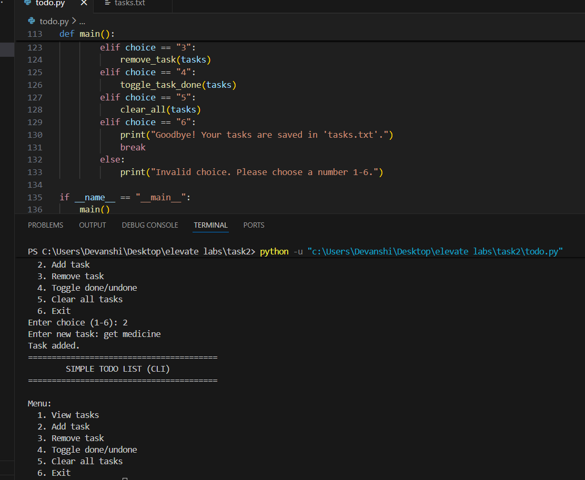

To-Do List Application (Python CLI)

    A simple console-based To-Do List Manager built using Python.
    This application supports adding, viewing, removing, marking tasks complete, and saving them permanently using a text file.

    This project demonstrates file handling, lists, string manipulation, and menu-driven CLI design.

✨ Features

    ➕ Add new tasks
    📋 View all tasks
    ❌ Remove tasks
    ✔ Mark tasks as done/undone (toggle)
    🧼 Clear all tasks
    💾 Persistent storage using tasks.txt
    Simple, user-friendly CLI menu

🛠️ Technologies Used

Python 3

    Lists
    Functions
    File handling (open, read/write)
    CLI-based user interaction

🚀 How to Run
    1. Clone the repository
    git clone https://github.com/Devansh-1609/TASK.2.git

    2. Run the application
    python todo.py

📸 Sample Output
    Here is an example of how the app looks:
    

🔮 Future Enhancements

    Due dates for tasks
    Priority levels (High/Medium/Low)
    Categorized task lists
    JSON-based storage
    GUI version (Tkinter or PyQt)

👤 Author

    Devanshi Modak
    Intern | Python Learner